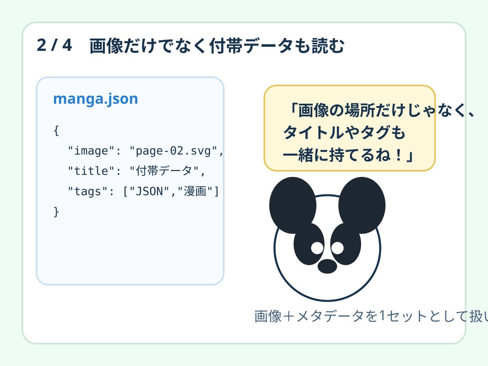
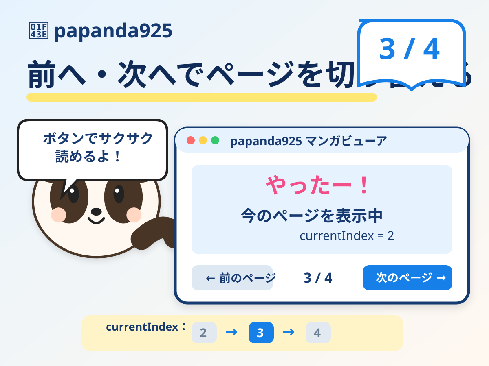

# Papanda Manga Viewer v0.1

画像データとJSONの付帯データを読み込み、ブラウザで **前のページ / 次のページ** に切り替える最小マンガビューアです。

今回のPapandaは **`papanda925 Character Sheet v1` を正本**として描き直しました。横向き4ページ版に加えて、同じ4ページを上から順に並べる **スマホ縦読み版** も公開しています。

## ライブデモ

- **[▶ 横向き4ページ版をブラウザで開く](https://papanda925.github.io/Daily-Code-Samples/demos/papanda-manga-viewer/)**
- **[▶ スマホ縦読み版をブラウザで開く](https://papanda925.github.io/Daily-Code-Samples/demos/papanda-manga-viewer-vertical/)**

## ソースコードを直接見る

READMEだけでなく、GitHub Pagesで動いている実ファイルへ直接進めます。

- [index.html — 横向きビューア本体](../../docs/demos/papanda-manga-viewer/index.html)
- [style.css — レスポンシブ表示](../../docs/demos/papanda-manga-viewer/style.css)
- [app.js — currentIndex / renderPage / 前後移動](../../docs/demos/papanda-manga-viewer/app.js)
- [manga.json — 画像パス・タイトル・説明・タグ](../../docs/demos/papanda-manga-viewer/manga.json)
- [pages/ — ビューアが実際に読む4枚](../../docs/demos/papanda-manga-viewer/pages/)
- [source/ — 教材として見やすく置いたソース](./source/)
- [CHARACTER_SOURCE.md — Character Sheet v1の固定ルール](./CHARACTER_SOURCE.md)

## サンプル画像

### 1 / 4 — ブラウザでページを切り替える


### 2 / 4 — 画像と付帯データを分けて持つ


### 3 / 4 — 前へ・次へでページを切り替える


### 4 / 4 — GitHub Pagesで公開する


## スマホ縦読み版

縦読み版は別の4枚を複製せず、**横向き版と同じ4枚をJSONから読み、上から順にDOMへ追加**します。

- [縦読み版README](../papanda-manga-viewer-vertical/)
- [縦読み版 index.html](../../docs/demos/papanda-manga-viewer-vertical/index.html)
- [縦読み版 app.js](../../docs/demos/papanda-manga-viewer-vertical/app.js)
- [縦読み版 manga-vertical.json](../../docs/demos/papanda-manga-viewer-vertical/manga-vertical.json)
- [縦読みイメージ](../../docs/demos/papanda-manga-viewer-vertical/vertical-sample.svg)


## ファイル構成

```text
web/papanda-manga-viewer/
├── README.md
├── CHARACTER_SOURCE.md
└── source/
    ├── index.html
    ├── app.js
    └── manga.json

docs/demos/papanda-manga-viewer/
├── index.html
├── style.css
├── app.js
├── manga.json
└── pages/
    ├── page-01.svg
    ├── page-02.svg
    ├── page-03.svg
    └── page-04.svg

docs/demos/papanda-manga-viewer-vertical/
├── index.html
├── style.css
├── app.js
├── manga-vertical.json
└── vertical-sample.svg
```

## 横向き版の中心

`currentIndex` で現在ページを持ち、`renderPage()` で同じ `` の `src` を差し替えます。

```javascript
function movePage(step) {
  const nextIndex = currentIndex + step;
  if (nextIndex < 0 || nextIndex >= pages.length) return;

  currentIndex = nextIndex;
  renderPage();
}
```

## 縦読み版の中心

縦読み版では4ページを全部DOMへ追加します。

```javascript
const fragment = document.createDocumentFragment();

data.pages.forEach((page, index) => {
  fragment.append(createPage(page, index, data.pages.length));
});

root.replaceChildren(fragment);
```

つまり、**データは共通、見せ方だけ変える**のが今回の実験です。

## 使用技術

- HTML
- CSS
- JavaScript
- JSON
- SVG
- GitHub Pages

外部JavaScriptライブラリは使用していません。
